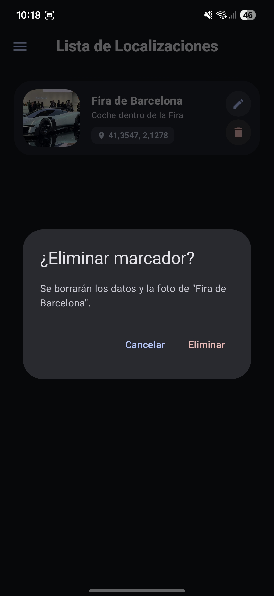

# GoogleMaps-API-App

Flujo principal y galería compacta.

App nativa en Kotlin con Google Maps SDK y Supabase: autenticación (login/register), creación y gestión de marcadores con imágenes (cámara/galería) y persistencia por usuario.

Flujo principal (resumido)

- Login / Register: acceso seguro con Supabase.
- Mapa: pantalla principal para explorar y añadir marcadores.
- Drawer: menú lateral con opciones "Mapa" y "Lista".
- Long click en el mapa: abre el formulario de creación de marcador.
- Guardar marcador: aparece un puntero en el mapa.
- Click en el puntero: abre la vista de detalles del marcador con la foto.
- Drawer → Lista: muestra todos los marcadores del usuario.
- Desde la lista: ver foto (previsualización), editar (cambiar imagen) o eliminar marcador.

Galería (3–4 por fila, imágenes reducidas)

  <figure style="flex:1 1 22%;max-width:200px;margin:0;">
    
    <figcaption style="font-size:12px;margin-top:6px">Login — inicio de sesión con Supabase.</figcaption>
  </figure>

  <figure style="flex:1 1 22%;max-width:200px;margin:0;">
    
    <figcaption style="font-size:12px;margin-top:6px">Registro — creación de cuenta.</figcaption>
  </figure>

  <figure style="flex:1 1 22%;max-width:200px;margin:0;">
    
    <figcaption style="font-size:12px;margin-top:6px">Mapa — vista principal donde se añaden marcadores.</figcaption>
  </figure>

  <figure style="flex:1 1 22%;max-width:200px;margin:0;">
    
    <figcaption style="font-size:12px;margin-top:6px">Drawer — opciones "Mapa" y "Lista" y "Cerrar Sesión".</figcaption>
  </figure>

  <figure style="flex:1 1 22%;max-width:200px;margin:0;">
    
    <figcaption style="font-size:12px;margin-top:6px">Formulario — se abre tras long click para crear marcador.</figcaption>
  </figure>

  <figure style="flex:1 1 22%;max-width:200px;margin:0;">
    
    <figcaption style="font-size:12px;margin-top:6px">Puntero — marcador visible en el mapa tras guardar.</figcaption>
  </figure>

  <figure style="flex:1 1 22%;max-width:200px;margin:0;">
    
    <figcaption style="font-size:12px;margin-top:6px">Detalles — vista al pulsar el puntero, incluye foto y metadatos.</figcaption>
  </figure>

  <figure style="flex:1 1 22%;max-width:200px;margin:0;">
    
    <figcaption style="font-size:12px;margin-top:6px">Lista — todos los marcadores del usuario.</figcaption>
  </figure>

  <figure style="flex:1 1 22%;max-width:200px;margin:0;">
    
    <figcaption style="font-size:12px;margin-top:6px">Previsualización — ver la foto desde la lista.</figcaption>
  </figure>

  <figure style="flex:1 1 22%;max-width:200px;margin:0;">
    
    <figcaption style="font-size:12px;margin-top:6px">Editar — cambiar imagen o datos del marcador.</figcaption>
  </figure>

  <figure style="flex:1 1 22%;max-width:200px;margin:0;">
    
    <figcaption style="font-size:12px;margin-top:6px">Eliminar — flujo para borrar un marcador.</figcaption>
  </figure>

