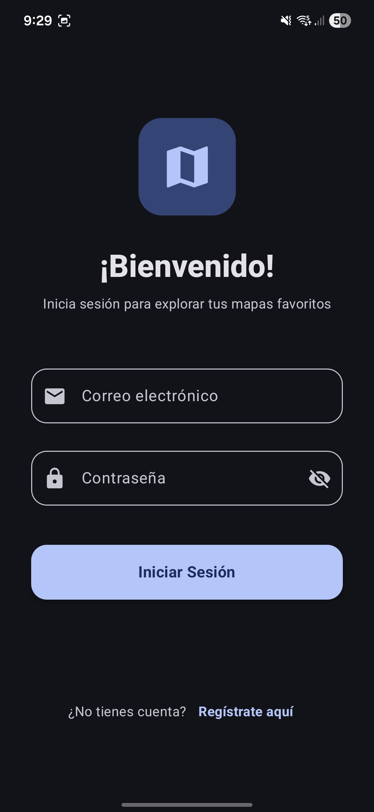
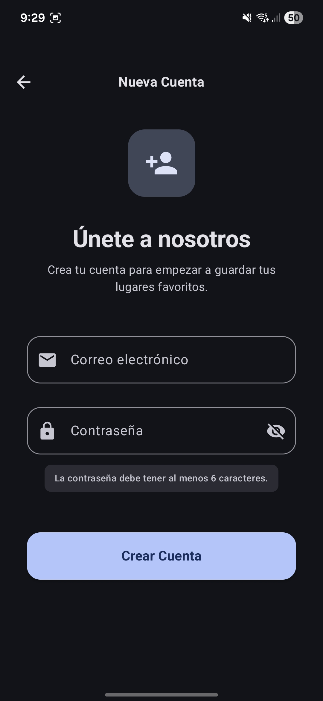
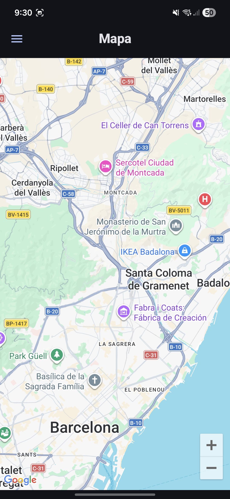
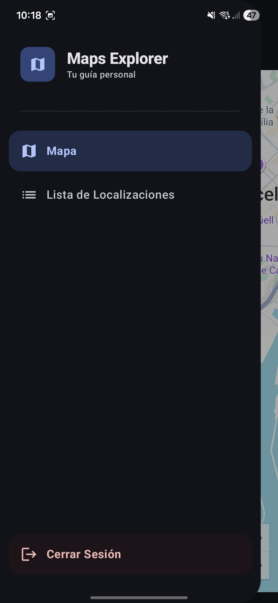
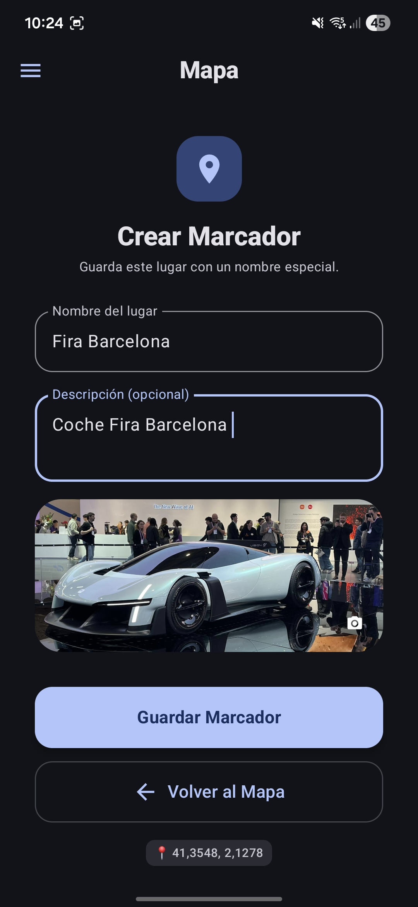
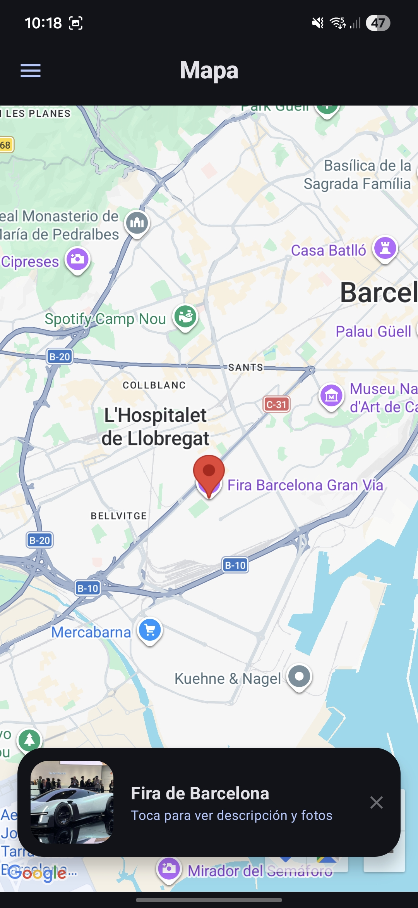
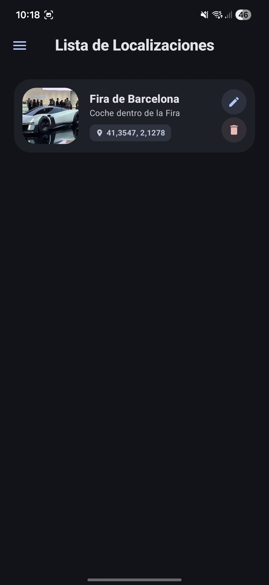
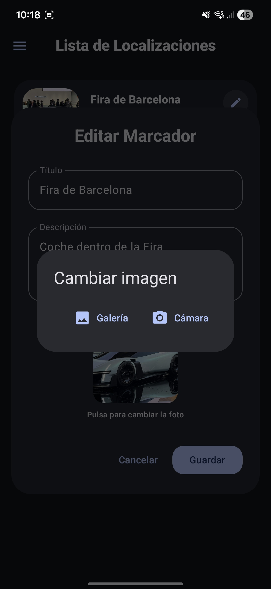

# GoogleMaps-API-App

Flujo principal y galería compacta.

App nativa en Kotlin y Jetpack Compose con Google Maps SDK y Supabase: autenticación (login/register), creación y gestión de marcadores con imágenes (cámara/galería) y persistencia por usuario.

## Flujo principal (resumido)

- Login / Register: acceso seguro con Supabase.
- Mapa: pantalla principal para explorar y añadir marcadores.
- Drawer: menú lateral con opciones "Mapa" y "Lista".
- Long click en el mapa: abre el formulario de creación de marcador.
- Guardar marcador: aparece un puntero en el mapa.
- Click en el puntero: abre la vista de detalles del marcador con la foto.
- Drawer → Lista: muestra todos los marcadores del usuario.
- Desde la lista: ver foto (previsualización), editar (cambiar imagen) o eliminar marcador.

## Capturas de pantalla

<table>
  <tr>
    <td align="center">
      
      
Login — inicio de sesión con Supabase.

    </td>
    <td align="center">
      
      
Registro — creación de cuenta.

    </td>
    <td align="center">
      
      
Mapa — vista principal donde se añaden marcadores.

    </td>
  </tr>
  <tr>
    <td align="center">
      
      
Drawer — opciones "Mapa" y "Lista" y "Cerrar Sesión".

    </td>
    <td align="center">
      
      
Formulario — se abre tras long click para crear marcador.

    </td>
    <td align="center">
      
      
Puntero — marcador visible en el mapa tras guardar.

    </td>
  </tr>
  <tr>
    <td align="center">
      
      
Detalles — vista al pulsar el puntero, incluye foto y metadatos.

    </td>
    <td align="center">
      
      
Lista — todos los marcadores del usuario.

    </td>
    <td align="center">
      
      
Previsualización — ver la foto desde la lista.

    </td>
  </tr>
  <tr>
    <td align="center" colspan="3">
      
      
Editar — cambiar imagen o datos del marcador.

    </td>
  </tr>
</table>
